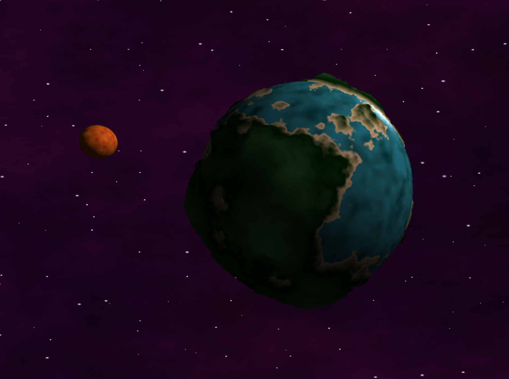

# CIS 566 Project 1: Noisy Planets

## Submission!
Name and Penn Key:
- Caroline Lachanski
- clach

Useful Sources:
https://gist.github.com/patriciogonzalezvivo/670c22f3966e662d2f83 (noise functions)
http://www.neilmendoza.com/glsl-rotation-about-an-arbitrary-axis/ (function to make a rotation matrix)

Demo:
https://clach.github.io/homework-1-noisy-planets-clach/

Screenshot:

Explanation:
The main planet is generated by first computing a height field using 3D FBM. Then, if the height value is above a certain threshold, I let that point be land; if it’s below, it’s water.  The land is textured with a Lambert shader. To create realistic looking terrain, I LERPED between the water color, the shore color, and two green grass colors based on the FBM height. The water is created with recursive Perlin noise (2 levels), and animated to look like waves. This height of water is also animated to vary slightly (using the FBM value). The water is overall textured with a Blinn-Phong shader. 

The moon rotates about itself and about the main planet. The main planet rotates about itself. 

The moon is initially textured with summed 3D Perlin noise. On top of that, I also used 3D Worley noise with a grid size of 4 to indent the surface with “craters.” To make these craters more noticeable, I colored them slightly darker too by passing my Worley noise distance value from the vertex shader to the fragment shader. These colors are overall textured with a Lambert shader.
